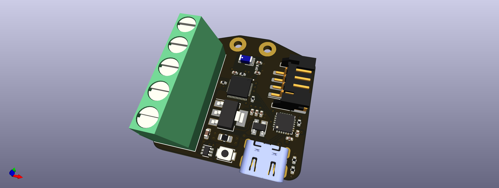

# ESP32-Tiny-LED-Controller

## Overview

The main goal of this project is to develop an OpenHardware board for controlling digital LED strips. The control shall be done via [Homeassistant](https://www.home-assistant.io) and [esphome](https://esphome.io).The PCB is based around an [ESP32-U4WDH](https://www.espressif.com/sites/default/files/documentation/esp32_datasheet_en.pdf) microcontroller and includes the following features: 

- 2,4GHz antenna for WLAN / Bluetooth 
- 5 pin screw terminal for external power and the LED-strip 
- USB-C connector
- USB-to-UART converter
- JST PH-S4B for connecting external sensors 

## ToDos

This PCB is a work in progress. The latest design is not tested and verified.  
